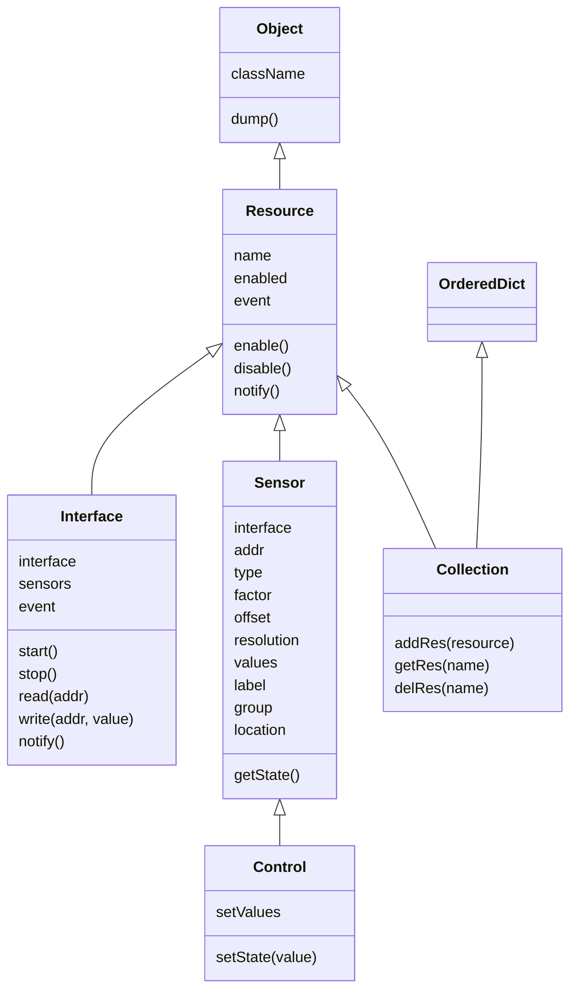
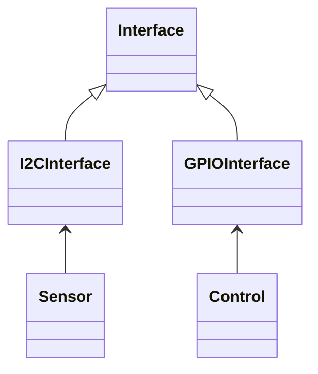

# Homealone object model

### Terminology

First, let's define the terminology used in this project.

##### HARDWARE
These describe the physical hardware that the system is built from.

- device - a hardware component that makes up the system
- sensor - a device that has a state that can be read
- control - a device that has a state that can be read and also changed
- server - a device that may be connected to one or more sensors and communicates with one or more clients
- client - a device that communicates with one or more servers
- interface - the connection over which two devices communicate

##### OBJECT MODEL
These are the core Python classes that are used to describe the system.

- Object - the base class for everything
- Resource - base class for resources
- Interface - a resource that is a representation of a physical interface
- Sensor - a resource that is a representation of a physical sensor
- Control - a resource that is a representation of a physical control
- Collection - a resource that is an ordered list of resources

##### IMPLEMENTATION
These terms describe the roles played by the software components in the system.

- application - the implementation of a collection of resources and interfaces that runs on a server
- service - an application that implements the server side of the Remote interface to a client device or server device
- client - an application that implements the client side of the Remote interface to a server device

### Object model
Physical devices are represented by members of an model that is defined within an application.  The object model is defined by the following core classes:

##### Object
The base class for Homealone objects.  It implements the dump() function which is used to serialize objects as JSON.  Deserialization is implemented by the static loadResource() function.

- className - The name of the class used to recreate a serialized object.  It may or may not be the same as the class name of an inherited object.
- dump() - Serialize the object to JSON.

##### Resource
The base class for all Homealone resources.

- name - The unique name for the resource.
- enabled - Indicates whether the Resource is enabled (active) or not.
- event - An Event object that is set when the state of the Resource changes.
- enable() - Enable the Resource.
- disable() - Disable the Resource.
- notify() - Set the Resource's event to announce a state change.

##### Interface
Defines the abstract class for interface implementations.

- interface - A reference to an Interface that this Interface is accessed through
- start() - Start (activate) the Interface.
- stop() - Stop (deactivate) the Interface.
- read(addr) - Read the current value from the specified address.
- write(addr, value) - Write the specified value to the specified address.

##### Sensor
Defines the model for the base Homealone sensor.

- interface - A reference to the Interface that this sensor is accessed through.
- addr - The address of the Sensor on the Interface.
- type - The type of Sensor.
- factor, offset, resolution -
- values -
- label - Human readable name for this Sensor.
- group - The list of groups that this Sensor is part of.
- location - The coordinates of the physical location of this Sensor.
- getState() - Return the current state of the Sensor.

##### Control
Defines the model for a sensor whose state can be changed.

- setValues -
- setState(value) - Set the state of the Control to the specified value.

##### Collection
Defines an ordered collection of references to Resources.

- addRes(resource) - Add the specified Resource to the Collection.
- getRes(name) - Return the Resource specified by the name from the Collection.
- delRes(name) - Remove the Resource specified by the name from the Collection.

### Example
A simple example is a temperature sensor that may be in a room, outside the house, or immersed in a swimming pool.  All it does is to report the ambient temperature of the air or water it is in.  Let's consider a digital temperature sensor that uses the I2C hardware interface.  When a read command is sent to the address of the device it returns a byte that represents the temperature in degrees Celsius.  Two software objects defined by this project are required: a Sensor and an Interface.  The Sensor can be just the base object because all it needs to do is to implement the get state function that reads the state of the sensor from the interface it is associated with.  The Interface object must be specific to the I2C interface so it is a I2CInterface object that is derived from the base Interface object.  It can use the Python SMBus library that performs all the low level I2C protocol functions to read a byte and implement the read function.

Another example is a sprinkler valve.  The state of the valve is either open or closed, and it is operated remotely from the network.  The voltage to the valve is switched using a relay or semiconductor that is controlled by a GPIO pin on the controller.  A Control object and an Interface object are needed to implement this.  The Control object inherits the get state function from the Sensor object, but it also defines a set state function that changes the state of the device.  The GPIOInterface object implements the read and write functions that get and set a GPIO pin.

