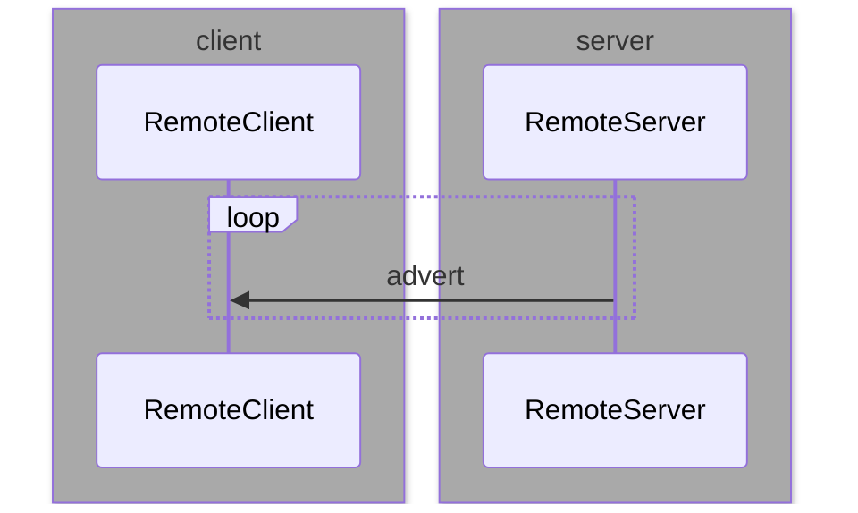

# Homealone home automation platform remote resource interface

### Overview
Homealone applications can expose their resources via a network interface that is described here. This allows a client application to access Homealone objects on other servers.

### Requirements
* Enables distributability of Homealone resource management
* Uses a client-server model
* Implements autodiscovery of Homealone services
* Implements notification of resource configuration changes
* Implements notification of resource state changes
* Servers are stateless in regards to the interface
* Does not implement a security model

### Terminology
* server - hardware that is running one or more Homealone applications
* hostname - the unique name for a server on the local network
* Homealone service - the implementation of the Homealone remote interface on a server
* Homealone resource - a Homealone object implemented within a Homealone application
* REST resource - an identifier used in the HTTP path in the REST interface that  describes a Homealone resource

### Interface
The interface consists of two parts:  A UDP message that is periodically broadcast by the server, and an HTTP server that supports a REST interface over TCP.  The UDP message performs the functions of advertising the availability of the server on the network, notifying clients of changes in the configuration or states of the server's Homealone resources, and letting clients know that the server is active.  The REST server allows clients to query details about Homealone resource configuration and states, and to direct a server to change the states of Control resources.

While a service publishes its resources for discovery on the network, this interface does not define a subscription model for clients.  A service is not aware of the clients that may be following it.  Clients maintain state for each service they are following, but services are stateless in regards to awareness of clients.  The only time a service is aware of a client is for the duration of the TCP connection for a REST request which is closed at the end of each request.

### Implementation

#### Components
The Remote interface is implemented by objects derived from the following classes:

* RemoteService - implements the server side of the interface
* RemoteClient - implements the client side of the interface
* ProxyService - used by RemoteClient to represent the proxy of a remote service
* RestInterface - a Homealone Interface object used by proxy resources in the client

#### Service advertising
A Homealone remote service uses a RemoteService object to send periodic messages to a known port of a multicast address to advertise itself on the local network.   The message contains the service name, and port that carries the corresponding REST interface that is implemented in an HTTP server. If multiple Homealone services are running on the same host they must use different HTTP ports.

The message contains a service REST resource and optionally a resources REST resource and states REST resource. If the message only contains a service REST resource, the message serves to notify clients that the server is still active and there haven't been any resource or state changes since the last message.  The timestamps will be the same as the previous message and the sequence number will contain the sequence number of the previous message incremented by 1.



#### Remote client
A client that wants to access remote resources creates a RemoteClient object.  This object listens on the remote advertising port for messages from remote servers.  When a message is received from a service that it hasn't previously seen, the client creates a ProxyService object to represent the remote service that sent the message.  The client then requests the remote server for a list of its remote resources, their attributes, and their states.  This is used to construct a set of resources that serve as proxies for the resources on that service.  Every resource in this Collection references a RestInterface that is associated with the ProxyService.

The proxy resources are members of a Collection that is associated with the ProxyService, and are also members of a Collection that contains resources from all other remote services being listened to by the client, as well as any additional local resources defined by the client.

#### Resource states
The client maintains a cache of states for all remote resources.  A remote service will broadcast an advertising message immediately upon the state change of one or more of its Homealone resources.  This message contains the current timestamp and the current states of all resources managed by the service.  This allows clients to receive timely notification of state changes and update the state cache without having to request it.  If a state change message is missed by a client, subsequent advertising messages will contain an updated timestamp and the client will be aware that its state cache is invalid.

A client may request the state of one or more resources via the REST interface at any time.  This will only need to occur if a state change notification is missed or when a service is discovered or restarted.

#### Notifications
If the state of a resource changes on a server, the next advertising message will include a states REST resource that contains the current states of all resources on the server and an updated resource timestamp.  The RemoteClient updates its state cache for that service with the new values.

If the configuration of a Homealone resource on a service changes, the next message will include both a resources REST resource, a states REST resource, and an updated state timestamp.  The client updates the proxied Homealone resources for that service, and update their states.

If a client receives a message from an active server that contains a changed timestamp but no resources or states REST resources, it will request either the resources or the states from the service via the REST interface and update its cache.

#### Error conditions
Once the RemoteClient learns of a remote service and creates a ProxyService, it must continue to receive periodic messages for that service.  If a message is not received within a configurable timeout period since the last message, the service is assumed to be disabled.  The ProxyService and all of its associated local resources are set to the disabled state.

If a message is received for a previously disabled service, RemoteClient updates the configuration and states of the local resources, querying the remote server via the REST interface if necessary, and enables the ProxyService and its associated resources.

If an unrecoverable error occurs while performing a read or write to the REST interface for a remote service, the service as well as all of its associated resources are disabled.

### REST interface
The REST interface follows the REpresentational State Transfer conventions for HTTP verb usage and path construction.  Messages are sent and received via TCP.  The TCP connection is opened and closed for each message.  All data is represented as JSON.

Each instance of a RemoteService on a physical server runs an HTTP server that handles the REST interface for that remote service.  The port number that an HTTP server listens on is selected from a pool of available ports on that server.  The port for each ProxyService is contained in the advertising message that is broadcast for that service.

#### Verbs
The HTTP following verbs are implemented by the remote server:
- GET - return attributes of the specified Homealone resource
- PUT - set the specified Homealone resource attribute to the specified value
- POST - create a new Homealone resource (not implemented)
- DELETE - delete the specified Homealone resource (not implemented)

#### Resource paths
REST resource paths are defined as follows:
```
/
	service/
		service attributes
	resources/
		resource 0/
			resource 0 attributes
		resource 1/
			resource 1 attributes
		...
		resource n/
			resource n attributes
	states/
		resource 0 state/
		resource 1 state/
		...
		resource n state/
```
The /service/ resource contains attributes of the Homealone service.
```
"service":  {"name": <service name>,
			 "hostname": <host name>,
			 "port": <port>,
			 "label": <service display name>,
			 "stateTimestamp": <last update time of the resource states>,
			 "resourceTimestamp": <last update time of the resources and attributes>,
			 "seq": <sequence number of the message>}
```
The /resources/ REST resource contains a JSON representation of the Homealone resource that the service is exposing.  It may be a single Homealone Resource but typically this is a Homealone Collection resource that contains a list of Homealone resource names.
```
"resources":{"class": "Collection",
			 "attrs": {"name": <resource collection name>,
			           "type": "collection",
			           "resources": [<resource 0 name>,
			                         <resource 1 name>,
			                         ...,
			                         <resource N name>]}}
```
The /resources/ REST resource may optionally contain the expanded JSON representations of all the resources rather than just a list of Homealone resource names.
```
"resources":{"class": "Collection",
			 "attrs": {"name": <resource collection name>,
			           "type": "collection",
			           "resources": [<resource 0>,
			                         <resource 1>,
			                         ...,
			                         <resource N>]}}
```

The /states/ resource contains a list of all the names and current states of the Homealone Sensor resources in the service.
```
{"states": {<resource 0 name>: <resource 0 state>,
            <resource 1 name>: <resource 1 state>,
            ...,
            <resource N name>: <resource N state>}}
```

#### Resource attributes
If an HTTP request is sent to the REST port on a host that is running the remote server the data that is returned from a GET is the JSON representation of the specified Homealone resource. Every Homealone Sensor resource has an implied attribute "state" that returns the current state of the sensor. It is not included in the list of attributes returned for the resource, however it may be queried in the same way as any other resource attribute. If an attribute references another resource, the value contains only the name of the referenced resource, not the JSON representation of that resource.  If an attribute references a class that is not a resource, the JSON representation of the object is the value of the attribute.
```
{"class": <class name>,
 "attrs": {<attr 0>: <value 0>,
           <attr 1>: <value 1>,
           ...,
           <attr N>: <value N>}}
```

### Examples
Examples 1-6 show messages that are used for discovery of the configuration of resources.  Examples 7-8 show messages that get the current state of resources.  Example 9 shows changing the state of a resource.  Example 10 shows the notification of state changes of resources.

1. Return the list of resources on the host sprinklers.local.

	   Request:     GET sprinklers.local:7378

	   Response:    ["service",
                     "resources",
                     "states"]

2. Return the attributes of the Homealone service on the host sprinklers.local.

	   Request:     GET sprinklers.local:7378/service

	   Response:    {"name": "sprinklerService",
					 "label": "Sprinklers",
					 "stateTimestamp": 1595529166,
					 "resourceTimestamp": 1595529166,
					 "seq": 666}

3. Return the list of Homealone resources on the host sprinklers.local.

        Request:     GET sprinklers.local:7378/resources

        Response:    {"class": "Collection",
                      "attrs": {"name": "resources",
                                "type": "collection",
                                "resources": ["gardenTemp",
                                              "gardenSprinkler"]}}

4. Return the list of Homealone resources on the host sprinklers.local containing the expanded
	resource representations.

     Request:     GET sprinklers.local:7378/resources?expand=true

     Response:    {"class": "Collection",
                   "attrs": {"name": "resources",
                             "type": "collection",
                             "resources": [{"class": "Sensor",
					                       "attrs": {"name": "gardenTemp",
					                                 "interface": "tempInterface"
					                                 "addr": 1,
					                                 "location": null,
					                                 "type": "tempC",
					                                 "group": "Sprinklers",
					                                 "label": "Garden temperature"}},
											 {"class": "Control",
						                     "attrs": {"name": "gardenSprinkler",
						                               "interface": "sprinklerInterface"
						                               "addr": 17,
						                               "location": null,
						                               "type": "sprinkler",
						                               "group": "Sprinklers",
						                               "label": "Garden sprinkler"}}]}}

5. Return the attributes for the resource "gardenSprinkler".  Note that the attribute
       "state" is not included.

       Request:     GET sprinklers.local:7378/resources/gardenSprinkler

	   Response:    {"class": "Control",
                     "attrs": {"name": "gardenSprinkler",
                               "interface": "sprinklerInterface"
                               "addr": 17,
                               "location": null,
                               "type": "sprinkler",
                               "group": "Sprinklers",
                               "label": "Garden sprinkler"}}

6. Return the value of the attribute "addr" of the resource "gardenSprinkler".

	   Request:     GET sprinklers.local:7378/resources/gardenSprinkler/addr

	   Response:    {"addr": 17}

7. Return the current state of the resource "gardenSprinkler".

       Request:     GET sprinklers.local:7378/resources/gardenSprinkler/state

       Response:    {"state": 0}

8. Return the current states of all resources on the host sprinklers.local.

       Request:     GET sprinklers.local:7378/states

       Response:    {"states": {"gardenTemp": 28.0,
                                "gardenSprinkler": 0}}

9. Set the state of the resource "gardenSprinkler" to 1.  The request body contains
	   the requested state.  The response body returns the resulting state.

       Request:     PUT sprinklers.local:7378/resources/gardenSprinkler/state
                    {"state": 1}

       Response:    {"state": 1}

10. Unsolicited message that is broadcast periodically and whenever one of the states changes that shows the current states of all resources in the service sprinklerService.

       Message:     
                    {"service": {"name": "sprinklerService",
                                 "label": "Sprinklers",
								 "stateTimestamp": 1595529456,
								 "resourceTimestamp": 1595529456,
                                 "seq": 667},
                     "states": {"gardenTemp": 28.0,
                                "gardenSprinkler": 0}}
