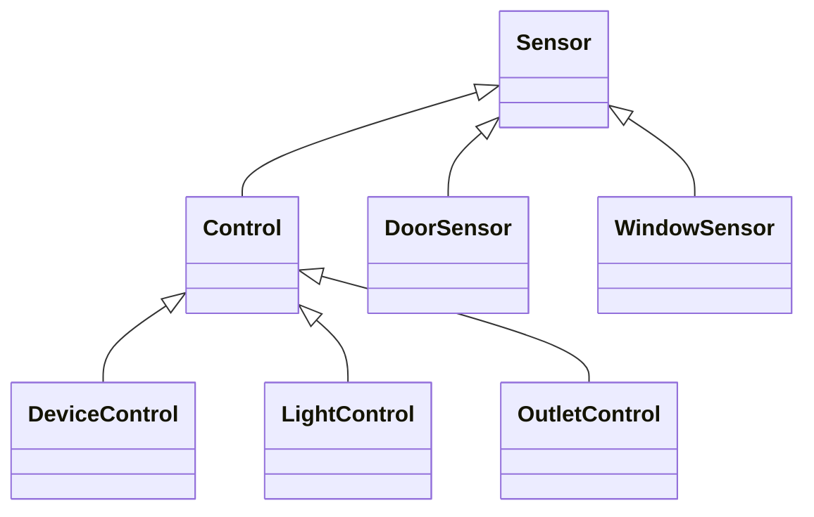
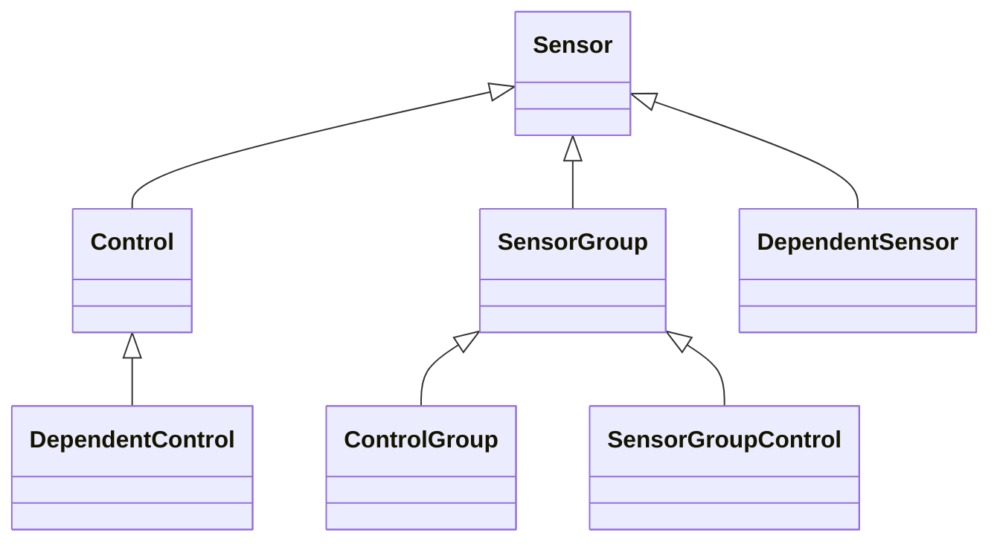
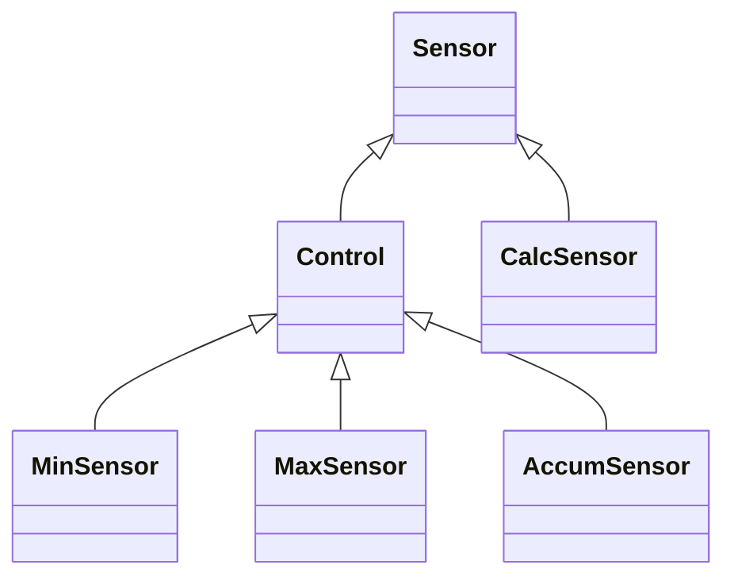
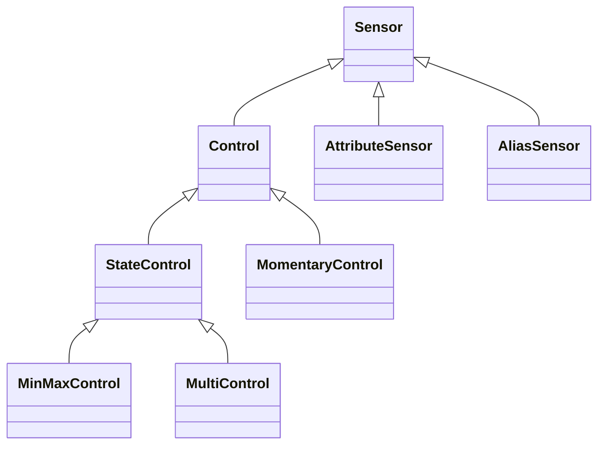
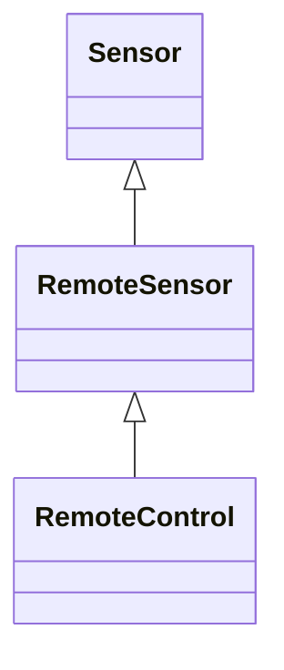
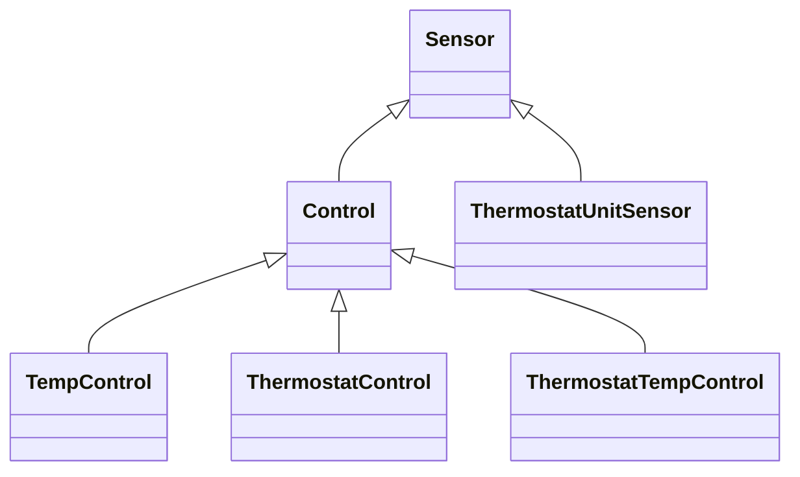
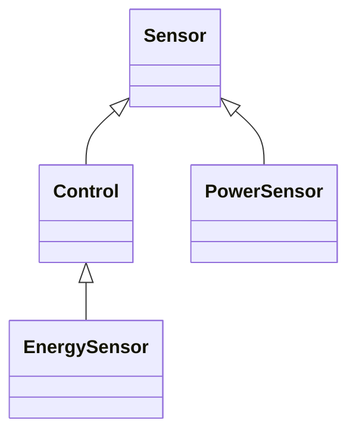

# Homealone home automation platform resources

### Interfaces
These modules have been developed that map a number of number of hardware devices to Homealone Interface objects.  Many of them are dependent on 3rd party libraries.

-  ADS1x15Interface - Interface to the ADS1x15 family of analog to digital converters.  It includes code from the Adafruit_ADS1x15 library.

-  FileInterface - An interface that provides persistent state.  Key value pairs are maintained as JSON in the OS filesystem.

-  GPIOInterface - Interface to the GPIO pins of the hardware device.  It uses the Python RPi.GPIO library.

-  I2CInterface - Interface to I2C devices using the Python smbus library.

-  MCP23017Interface - This interface allows use of the MCP23017 GPIO extender to provide additional GPIO pins.

-  OSInterface - An interface that provides access to a few key OS metrics.

-  OWFSInterface - Interface to the One Wire File System that supports 1-wire devices connected in a variety of ways such as serial, USB, I2C, and GPIO.

-  SerialInterface - An interface that provides access to serial devices.

-  TC74Interface - Interface to the TC74 temperature sensor.

-  TimeInterface - Provides an interface for various time functions.

-  TPLinkInterface - A proxy to TPLink devices using the TP-Link Smart Home Protocol.

-  W1Interface - Interface to the W1 interface that supports 1-wire temperature sensors connected directly to GPIO.  It uses the w1thermsensor interface.

### Sensor and Control resources
These modules implement Sensors and Controls for more complex functions that build on the Homealone core classes.

#### Typical devices
These Resources represent typical home automation devices that are likely to exist.

- DeviceControl - A Control for a generic device with two enumerated states.
- LightControl - A Control for a light switch.
- OutletControl - A Control for an electrical outlet.
- DoorSensor - A Sensor for a door.
- WindowSensor - A Sensor for a window.

#### Collections of devices
These implement virtual Resources that relate to multiple Sensors or Controls.

- SensorGroup - A collection of sensors whose state is on if any one of them is on.
- ControlGroup - A set of Controls whose state can be changed together.
- SensorGroupControl - A Control whose state depends on the states of a group of Sensors.
- DependentSensor - A Sensor that only reports its state if all the specified resources are in the specified states.
- DependentControl - A Control that can only be turned on if all the specified resources are in the specified states.

#### Math related resources
These Sensors do not correspond directly to hardware devices, but their numeric state is derived from the state(s) of other Sensors that have numeric states.

- CalcSensor - A Sensor that calculates a specified function using a list of sensor states.
- MinSensor - A Sensor that captures the minimum state value of the specified sensor.
- MaxSensor - Sensor that captures the maximum state value of the specified sensor.
- AccumSensor - A Sensor that captures the accumulated state values of the specified sensor.

#### Special resources
These Resources have specialized functionality.

- StateControl - A Control that has a persistent state.
- MinMaxControl - A Control that has specified numeric limits on the values it can be set to.
- MultiControl - A Control that has a specified list of values it can be set to.
- MomentaryControl - A Control that can be set on but reverts to off after a specified time.
- AttributeSensor - A sensor that returns the value of an attribute of a specified sensor.
- AliasSensor - A Sensor that is an alias for another sensor.

#### Remote devices
Devices that are on a different server that are accessed remotely.

- RemoteSensor - A Sensor that is located on another server.
- RemoteControl - A Control that is located on another server.

#### Temperature related resources

- TempControl - A Control that manages a heating or cooling unit.
- Thermostat control - A control that emulates a device for controlling a heating and cooling system.
- ThermostatUnitSensor - A Sensor that returns the thermostat unit control that is currently running.
- ThermostatTempControl - A Control that sets the target temperature of the active unit control.

#### Electrical sensors
Sensors related to electrical devices.

- PowerSensor - A Sensor that calculates the power given a voltage, current, and optional power factor.
- EnergySensor - A Sensor that accumulates energy over time.
