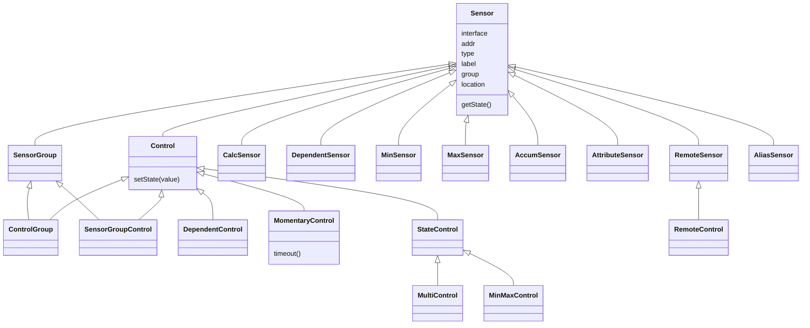
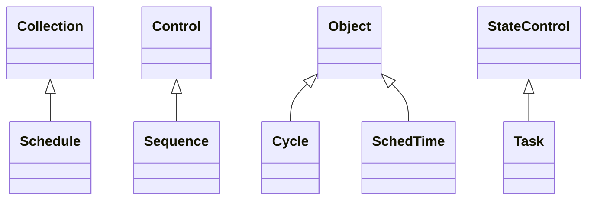
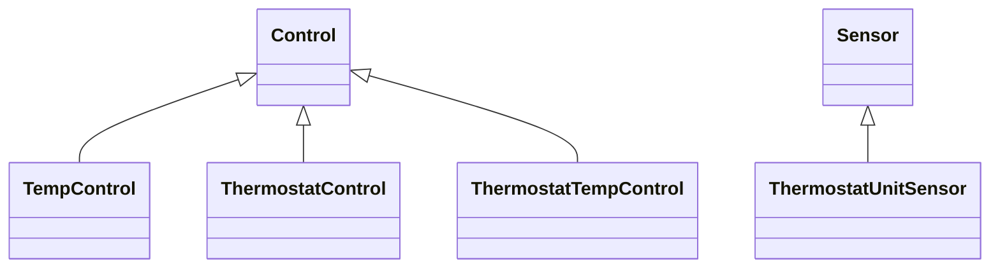
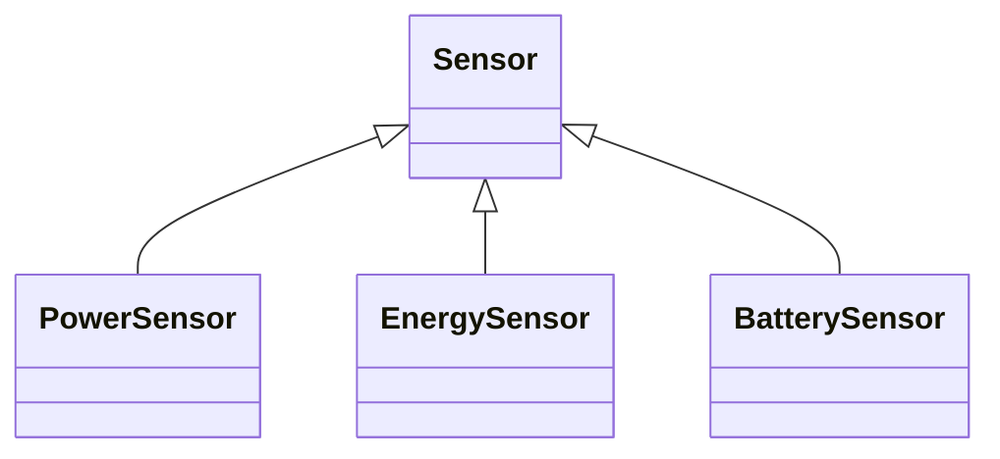

# Homealone home automation platform resources

### Interfaces
These modules have been developed that map a number of number of hardware devices to Homealone Interface objects.  Many of them are dependent on 3rd party libraries.

-  ADS1x15Interface - Interface to the ADS1x15 family of analog to digital converters.  It includes code from the Adafruit_ADS1x15 library.

-  FileInterface - An interface that provides persistent state.  Key value pairs are maintained as JSON in the OS filesystem.

-  GPIOInterface - Interface to the GPIO pins of the hardware device.  It uses the Python RPi.GPIO library.

-  I2CInterface - Interface to I2C devices using the Python smbus library.

-  MCP23017Interface - This interface allows use of the MCP23017 GPIO extender to provide additional GPIO pins.

-  OSInterface - An interface that provides access to a few key OS metrics.

-  OWFSInterface - Interface to the One Wire File System that supports 1-wire devices connected in a variety of ways such as serial, USB, I2C, and GPIO.

-  SerialInterface - An interface that provides access to serial devices.

-  TC74Interface - Interface to the TC74 temperature sensor.

-  TimeInterface - Provides an interface for various time functions.

-  TPLinkInterface - A proxy to TPLink devices using the TP-Link Smart Home Protocol.

-  W1Interface - Interface to the W1 interface that supports 1-wire temperature sensors connected directly to GPIO.  It uses the w1thermsensor interface.

### Sensor and Control resources
These modules implement Sensors and Controls for more complex functions that build on the Homealone core classes.

#### Extra resources
A collection of generally useful Sensors and Controls.

- SensorGroup -
- ControlGroup -
- SensorGroupControl -
- CalcSensor -
- DependentSensor -
- DependentControl -
- MomentaryControl -
- StateControl -
- MultiControl -
- MinMaxControl -
- MinSensor -
- MaxSensor -
- AccumSensor -
- AttributeSensor -
- RemoteSensor -
- RemoteControl -
- AliasSensor -

#### Time related resources
These classes are inherited from the core classes and implement time based functions:

- Schedule -
- Task -
- SchedTime -
- Sequence -
- Cycle -

#### Temperature related resources

- TempControl - A Control that manages a heating or cooling unit.
- Thermostat control - A control that emulates a device for controlling a heating and cooling system.
- ThermostatUnitSensor -
- ThermostatTempControl -

#### Electrical sensors
Sensors related to electrical devices.

- PowerSensor -
- EnergySensor -
- BatterySensor -
