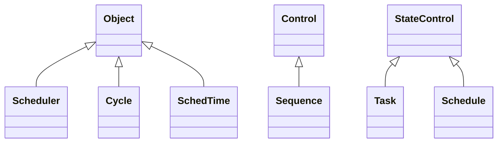

#### Time related resources
These classes are inherited from the core classes and implement time based functions:

- Cycle - A Cycle describes the process of setting a Control to a specified state, waiting a specified length of time, and setting the Control to another state.  This may be preceded by an optional delay.
- Sequence - A list of one or more Cycles and/or other Sequences that are run sequentially.
- Task - A Task specifies a Control and a state that the Control should be set to at a specified time.
- SchedTime - A SchedTime defines a date and time to perform a task. Year, month, day, hour, minute, and weekday may be specified as a list of zero or more values. If a list contains zero values it is interpreted to mean the task should be run every minute, hour, etc.  Relative dates of "today" or "tomorrow" and events of "sunrise" or "sunset" may also be specified. If an event and a time (hours, minutes) are specified, the time is considered to be a delta from the event and may contain negative values.
- Schedule - A Schedule contains a list of Tasks for a particular Control that are executed at their specified times.
- Scheduler - The schedule manager.  Executes Tasks at their specified times.  Granularity is one minute.
