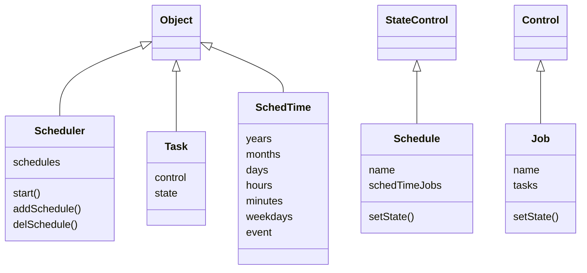

# Homealone scheduler

The Scheduler allows for the states of Homealone Controls to be set at various times.

### Scheduler classes
These classes are inherited from the core classes to implement functions of the Scheduler.



#### Scheduler
The schedule manager.  Runs Jobs referenced by Schedules at their specified times.  Granularity is one minute.
```
scheduler = Scheduler([schedule,...]) - Instantiate a Scheduler.
scheduler.start() - Start the scheduler.
scheduler.addSchedule(schedule) - Add a schedule to the scheduler's list
scheduler.delSchedule(scheduleName) - Delete a schedule from the scheduler's list
```
#### Schedule
A list of one or more Jobs and times at which they are to be run.  Because it inherits from StateControl, the state (enabled or disabled) is persistent.
```
schedule = Schedule(name, [(schedTime, job),...]) - Instantiate a Schedule.
schedule.setState(state) - Enable or disable the schedule.
```
#### Job
A list of one or more Tasks and/or Jobs that are run sequentially. It may be run at a specified time by the scheduler or it may be run when called by another Job or manually activated.  Setting the state to On immediately runs the Job.
```
job = Job(name, [task|job,...]) - Instantiate a Job.
job.setState(On) - Run the job.
```
#### Task
A Task references a Control and a state to which the Control is to be set.
```
task = Task(control, state) - Instantiate a Task.
```
#### SchedTime
A SchedTime defines a set of dates and times to run a Job. Year, month, day, hour, minute, and weekday may be specified as a list of zero or more values. If a list contains zero values it is interpreted to mean the Job should be run every day, hour, minute, etc.  Events such as "sunrise" or "sunset" may also be specified. The exact time will be computed for the location and current day.  If an event and a time (hours, minutes) are both specified, the time is considered to be a delta from the event and may contain negative values.
```
schedTime = SchedTime(schedString) - Instantiate a SchedTime.
```
### Examples

1. Turn on porch lights every day at sunset.
```
Job("porchLightsOnJob", [
    Task(frontPorchLight, On),
    Task(backPorchLight, On)])
Schedule("porchLightsOnSunset", [
        ("sunset", porchLightsOnJob)])
```
2. Run the back lawn sprinklers for 20 minutes. It will run when called by another Job or manually run.
```
Job("backLawnJob", [Task(backLawnValve, On),
                    Task(delayControl, 20),
                    Task(backLawnValve, Off)])
```
3. Run all sprinklers three days a week at 5PM during the months of April through October.
```
Job("weeklySprinklersJob", [backLawnJob, backBedsJob,
							frontLawnJob, gardenJob])
Schedule("sprinklerSchedule", [("Apr-Oct Mon,Wed,Fri 17:00",
								weeklySprinklersJob)])
```
4. Turn on the hot water recirculating pump every day at 6AM and off at 11PM.
```
Job("recircPumpOnJob", [Task(recircPump, On)])
Job("recircPumpOffJob", [Task(recircPump, Off)])
Schedule("recircPumpSchedule", [("6:00", recircPumpOnJob),
							   ("23:00", recircPumpOffJob)])
```
5. Scheduled times represented as human readable strings.
```
"17:00" - at 5pm every day
":00,:10,:20,:30,:40,:50" - every 10 minutes
"sunrise" - at sunrise every day
"sunset -:20" - 20 minutes before sunset every day
"Dec 25 6:00" - December 25 at 6am every year
"Apr-Oct 13:00" - every day April through October at 1pm
"May,Aug sunset" - every day in May and August at sunset
"Mon,Wed,Fri 18:00" - every Monday, Wednesday, and Friday at 6pm
"Mon-Fri 12:00" - every weekday at noon
"2023 Sep 24" - every minute on the day September 24 2023
```
