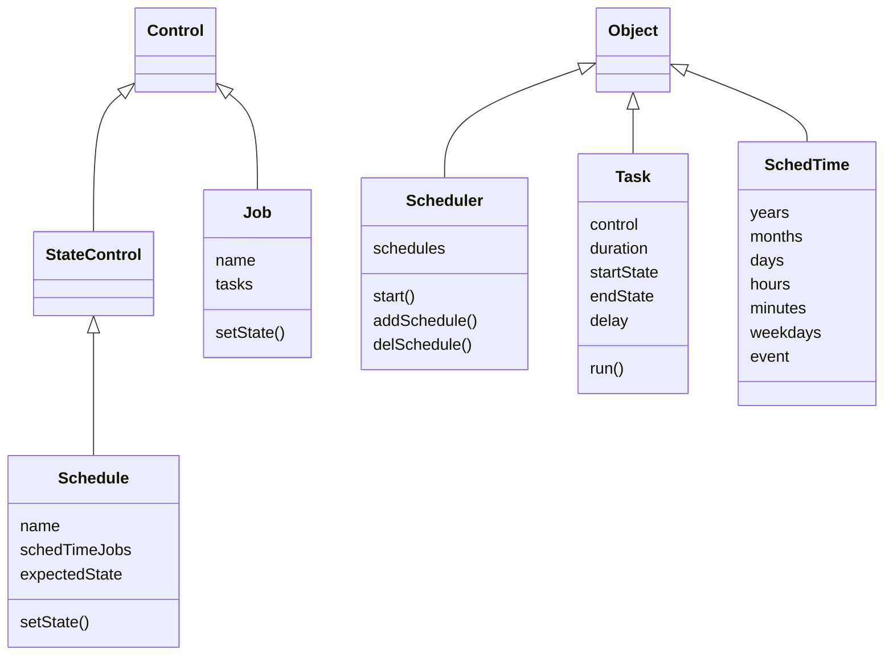

<!-- http://mermaid.js.org/ -->

# Homealone scheduler

The Scheduler manages the states of Homealone Controls based on times.

### Terminology

- Task - Sets the state of a specified Control object to a specified value
- Job - A list of one or more Tasks that are executed in a specific order
- Schedule - A list of one or more Jobs that are run at specified dates and times
- SchedTime - Specification of a date and time to run a Job
- Scheduler - The object that is responsible for managing and running Schedules

### Scheduler classes
These classes are inherited from the Homealone core classes to implement functions of the Scheduler.  The StateControl class is defined in the extra classes.



#### Scheduler
The schedule manager.  Runs Jobs referenced by Schedules at their specified times.  Granularity is one minute.
```
scheduler = Scheduler([schedule,...]) - Instantiate a Scheduler.
scheduler.start() - Start the scheduler.
scheduler.addSchedule(schedule) - Add a schedule to the scheduler's list
scheduler.delSchedule(scheduleName) - Delete a schedule from the scheduler's list
```
#### Schedule
A list of one or more Jobs and times at which they are to be run.  Because it inherits from StateControl, the state of a Schedule (enabled or disabled) is persistent.  Scheduled times and Jobs are represented as a list of tuples.  If the expectedState attribute is set to True, all of the Controls referenced in the Schedule will be set to the expected state at the time the Scheduler is started, based on the Schedule.
```
schedule = Schedule(name, [(schedTime, job),...], expectedState=False) - Instantiate a Schedule.
schedule.setState(state) - Enable or disable the schedule.
```
#### Job
A list of one or more Tasks and/or Jobs that are run sequentially. Tasks may be defined either as a reference to a previously defined Task object, or a tuple containing a reference to a control and a state.  References to Tasks, Jobs, or explicit tuples may be intermixed.  It may be run at a specified time by the scheduler or it may be run when called by another Job or manually activated.  Setting the state to On immediately runs the Job. Setting the state to Off immediately stops the job if it is running.
```
job = Job(name, [task|(control, state)|job,...]) - Instantiate a Job.
job.setState(On) - Run the job.
job.setState(Off) - Stop the job if it is running.
```
#### Task
A Task describes the process of setting a Control to a specified state, waiting a specified length of time, and setting the Control to another state. This may be preceded by an optional delay.  If the duration is None, then the end state is not set and the Control is left in the start state.    The state arguments may either be literal values, or they may be a reference to Sensor objects, in which case the state value is obtained from the state of the Sensor at the time the Task is executed.
```
task = Task(control, duration, startState=On, endState=Off, [delay]) - Instantiate a Task.
task.run() - Run the Task
```
#### SchedTime
A SchedTime defines a set of elements that specify dates and times to run a Job. The time reference is always the local time of the server.  Year, month, day, hour, minute, and weekday may be specified as ranges or as a list of zero or more values. If no value is specified it is interpreted to mean the Job should be run every day, hour, minute, etc.  

All events, except for event, are stored internally in the SchedTime object as lists of integers.  Month values are 1-12, beginning in January.  Weekdays are 0-6, beginning on Monday. Events such as "sunrise" or "sunset" may also be specified. The exact time will be computed for the location and current day.  If an event and a time (hours, minutes) are both specified, the time is considered to be a delta from the event and may contain negative values.

A SchedTime is instantiated by specifying a human readable timeSpec string that is parsed into the internal elements, or the elements may be specified directly.  If both are specified, the timeSpec string takes precedence.  If elements are specified, they may be either integers or lists of integers, except for event which must be a string.  If a timeSpec string is specified, it may contain any of the following items separated by spaces:

year - an integer > 31
month - the name of a month which can be abbreviated to 2 or more characters
day - an integer <= 31 and > 0
hour - an integer between 0 and 23 followed by a ":"
minute - an integer between 0 and 59 preceded by a ":"
weekday - the name of a weekday which can be abbreviated to 2 or more characters
event = "sunrise" or "sunset"

Elements may be specified in any order and they are not case sensitive.  Any of the elements, except event, may consist of a comma delimited list of multiple instances of that elements, or a range of values for the element delimited by a "-".

```
schedTime = SchedTime(timeSpec) - Instantiate a SchedTime based on a human readable string.
schedTime = SchedTime(None, year, month, day, hour, minute, weekDay, event) - Instantiate a schedTime with specific elements
```
### Examples

1. Turn on porch lights every day at sunset.
```
porchLightsOnJob = Job("porchLightsOnJob", [Task(frontPorchLight, On),
                                            Task(backPorchLight, On)])
porchLightsOnSunset = Schedule("porchLightsOnSunset", ("sunset", porchLightsOnJob))
```
2. Run the back lawn sprinklers for 20 minutes (1200 seconds). The sprinkler valve Control is turned on, then it waits for 20 minutes, and finally the sprinkler valve Control is turned off.  It will run when called by another Job or manually run.
```
backLawn = Job("backLawn", [Task(backLawnValve, 1200)])
```
3. Run all sprinklers three days a week at 5PM during the months of April through October.  Assume that Jobs similar to the previous example have been defined for all sprinkler valves.
```
weeklySprinklersJob = Job("weeklySprinklersJob", [backLawnJob, backBedsJob, frontLawnJob, gardenJob])
sprinklerSchedule = Schedule("sprinklerSchedule", [("Apr-Oct Mon,Wed,Fri 17:00", weeklySprinklersJob)])
```
4. Turn on the hot water recirculating pump Control every day at 6AM and off at 11PM.  Set the Control to the expected state it should be in when the Scheduler is started, e.g. if the Scheduler starts between 6am and 11pm, the Control will be set on, if the Scheduler starts after 11pm the Control will be set off.  If the Scheduler starts before 6am the state of the Control whatever the initial state is that is defined by the Control object.
```
recircPumpOnJob = Job("recircPumpOnJob", [Task(recircPumpControl, On)])
recircPumpOffJob = Job("recircPumpOffJob", [Task(recircPumpControl, Off)])
recircPumpSchedule = Schedule("recircPumpSchedule", [("6:00", recircPumpOnJob),
                                                     ("23:00", recircPumpOffJob)],
                                                     expectedState=True)
```
5. Scheduled times represented as human readable strings.  These examples show a string, its interpretation, and how it is stored internally in the SchedTime object.

Examples of valid time specs:
```
"17:00" - at 5pm every day - [],[],[],[17],[0],[],[]
":00,:10,:20,:30,:40,:50" - every 10 minutes - [],[],[],[],[0,10,20,30,40,50],[],[]
"sunrise" - at sunrise every day - [],[],[],[],[],[],["sunrise"]
"sunset -:20" - 20 minutes before sunset every day - [],[],[],[],[-20],[],["sunset"]
"December 7 1941 7:48" - a day that will live in infamy - [1941],[12],[7],[7],[48],[]
"Dec 25 6:00" - on December 25 at 6am every year - [],[12],[25],[6],[0],[],[],""
"Jun 21 sunrise" - at sunrise on June 21 every year - [],[12],[21],[],[],[],["sunrise"]
"Apr-Sep 13:00" - every day April through September at 1pm - [],[4,5,6,7,8,9],[13],[0],[],[]
"May,Aug sunset" - every day in May and August at sunset - [],[5,8],[],[],[],[],["sunset"]
"Mon,Wed,Fri 18:00" - every Monday, Wednesday, and Friday at 6pm - [],[],[],[18],[0],[0,2,4],[]
"mo-fr 12:00" - every weekday at noon - [],[],[],[12],[0],[0,1,2,3,4],[]
"2023 Sep 24" - every minute on the day September 24 2023 - [2023],[9],[24],[],[],[],[]
"1 9:00" - on the first of every month at 9am - [],[],[1],[9],[0],[],[]
"30 12:00" - at noon on the 30th of every month except February - [],[],[30],[12],[0],[],[]
```
Examples of time specs that are syntactically valid but don't look like they should be:
```
"" - every minute - [],[],[],[],[],[],[]
"1066 Dec 25" - every minute during the day 25 Dec 1066 - [1066],[12],[25],[],[],[],[]
"Jun 42 sunrise" - at sunrise every during the month of June in the year 42 - [42],[6],[],[],[],[],['sunrise']
"Mon,Wed,Fri,Feb 18:00" - at 6pm on Mon,Wed,Fri during the month of February - [],[2],[],[18],[0],[0, 2, 4],[]
"Jan Wed Fri Feb" - every minute on Wednesday and Friday during January and February - [],[1, 2],[],[],[],[2, 4],[]
"12:" - every day at noon - [],[],[],[12],[],[],[]
"1,2,4,8,16,32,64,128,256" - - [32, 64, 128, 256],[],[1, 2, 4, 8, 16],[],[],[],[]
```
Examples of invalid time specs:
```
"17:00:00" -
"Fridays 17:00" -
"Apr-Sep-Dec 13:00" -
":00,:1O,:20,:30,:40,:50" -
"Fri-Mon 12:00" -
"May,Aug noon" -
"2023 Septober 24" -
"-1 9:00" -
"0 12:00" -
"sunset -20" -
"random garbage" -
```
