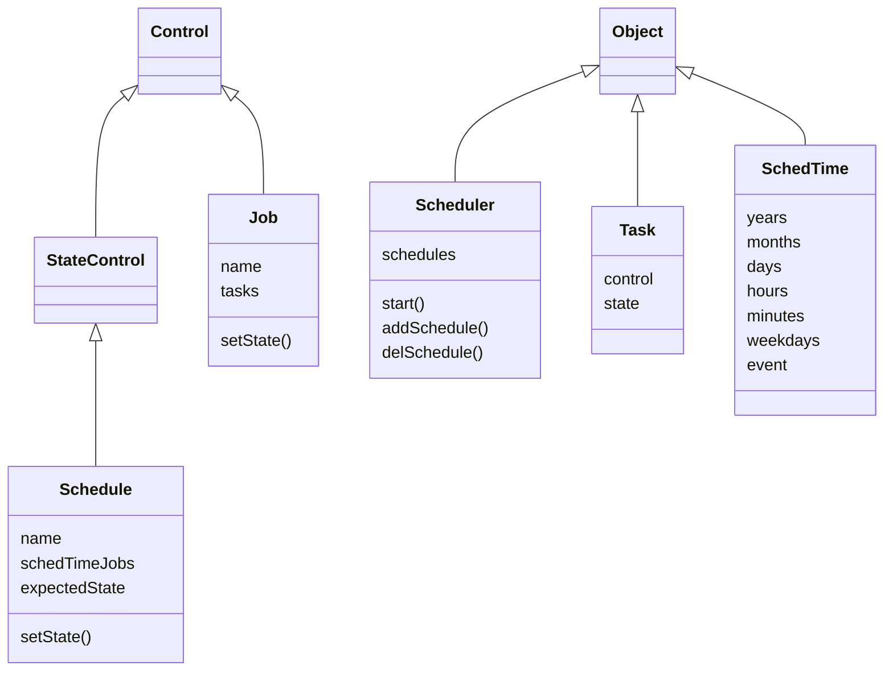

# Homealone scheduler

The Scheduler allows for the states of Homealone Controls to be set at various times.

### Scheduler classes
These classes are inherited from the core and extra resource classes to implement functions of the Scheduler.



#### Scheduler
The schedule manager.  Runs Jobs referenced by Schedules at their specified times.  Granularity is one minute.
```
scheduler = Scheduler([schedule,...]) - Instantiate a Scheduler.
scheduler.start() - Start the scheduler.
scheduler.addSchedule(schedule) - Add a schedule to the scheduler's list
scheduler.delSchedule(scheduleName) - Delete a schedule from the scheduler's list
```
#### Schedule
A list of one or more Jobs and times at which they are to be run.  Because it inherits from StateControl, the state of a Schedule (enabled or disabled) is persistent.  If the expectedState attribute is set to True, all of the Controls referenced in the Schedule will be set to the expected state at the time the Scheduler is started, based on the Schedule.
```
schedule = Schedule(name, [(schedTime, job),...], expectedState=False) - Instantiate a Schedule.
schedule.setState(state) - Enable or disable the schedule.
```
#### Job
A list of one or more Tasks and/or Jobs that are run sequentially. It may be run at a specified time by the scheduler or it may be run when called by another Job or manually activated.  Setting the state to On immediately runs the Job.
```
job = Job(name, [task|job,...]) - Instantiate a Job.
job.setState(On) - Run the job.
job.setState(Off) - Immediately stop the job if it is running.
```
#### Task
A Task references a Control and a state to which the Control is to be set.
```
task = Task(control, state) - Instantiate a Task.
```
#### SchedTime
A SchedTime defines a set of dates and times to run a Job. Year, month, day, hour, minute, and weekday may be specified as a list of zero or more values. If a list contains zero values it is interpreted to mean the Job should be run every day, hour, minute, etc.  

All values, except for event, are stored internally in the SchedTime object as lists of integers.  Month values are 1-12, beginning in January.  Weekdays are 0-6, beginning on Monday. Events such as "sunrise" or "sunset" may also be specified. The exact time will be computed for the location and current day.  If an event and a time (hours, minutes) are both specified, the time is considered to be a delta from the event and may contain negative values.
```
schedTime = SchedTime(schedString) - Instantiate a SchedTime.
```
### Examples

1. Turn on porch lights every day at sunset.
```
porchLightsOnJob = Job("porchLightsOnJob", [Task(frontPorchLight, On),
                                            Task(backPorchLight, On)])
porchLightsOnSunset = Schedule("porchLightsOnSunset", [("sunset", porchLightsOnJob)])
```
2. Run the back lawn sprinklers for 20 minutes. The sprinkler valve Control is turned on, then a Control that delays for 20 minutes is enabled, and finally the sprinkler valve Control is turned off.  It will run when called by another Job or manually run.
```
backLawnJob = Job("backLawnJob", [Task(backLawnValve, On),
                                  Task(delayControl, 20),
                                  Task(backLawnValve, Off)])
```
3. Run all sprinklers three days a week at 5PM during the months of April through October.  Assume that Jobs similar to the previous example have been defined for all sprinkler valves.
```
weeklySprinklersJob = Job("weeklySprinklersJob", [backLawnJob, backBedsJob,
                                                  frontLawnJob, gardenJob])
sprinklerSchedule = Schedule("sprinklerSchedule", [("Apr-Oct Mon,Wed,Fri 17:00",
                                                    weeklySprinklersJob)])
```
4. Turn on the hot water recirculating pump Control every day at 6AM and off at 11PM.  Set the Control to the expected state it should be in when the Scheduler is started, e.g. if the Scheduler starts between 6am and 11pm, the Control will be set on, if the Scheduler starts after 11pm the Control will be set off.  If the Scheduler starts before 6am the state of the Control whatever the initial state is that is defined by the Control object.
```
recircPumpOnJob = Job("recircPumpOnJob", [Task(recircPumpControl, On)])
recircPumpOffJob = Job("recircPumpOffJob", [Task(recircPumpControl, Off)])
recircPumpSchedule = Schedule("recircPumpSchedule", [("6:00", recircPumpOnJob),
                                                     ("23:00", recircPumpOffJob)],
                                                     expectedState=True)
```
5. Scheduled times represented as human readable strings.  These examples show a string, its interpretation, and how it is stored internally in the SchedTime object.
```
"17:00" - at 5pm every day - [],[],[],[17],[0],[],[]
":00,:10,:20,:30,:40,:50" - every 10 minutes - [],[],[],[],[0,10,20,30,40,50],[],[]
"sunrise" - at sunrise every day - [],[],[],[],[],[],["sunrise"]
"sunset -:20" - 20 minutes before sunset every day- [],[],[],[],[-20],[],["sunset"]
"Dec 25 6:00" - on December 25 at 6am every  - [],[12],[25],[6],[0],[],[]
"Apr-Sep 13:00" - every day April through September at 1pm - [],[4,5,6,7,8,9],[13],[0],[],[]
"May,Aug sunset" - every day in May and August at sunset - [],[5,8],[],[],[],[],["sunset"]
"Mon,Wed,Fri 18:00" - every Monday, Wednesday, and Friday at 6pm - [],[],[],[18],[0],[0,2,4],[]
"Mon-Fri 12:00" - every weekday at noon - [],[],[],[12],[0],[0,1,2,3,4],[]
"2023 Sep 24" - every minute on the day September 24 2023 - [2023],[9],[24],[],[],[],[]
```
